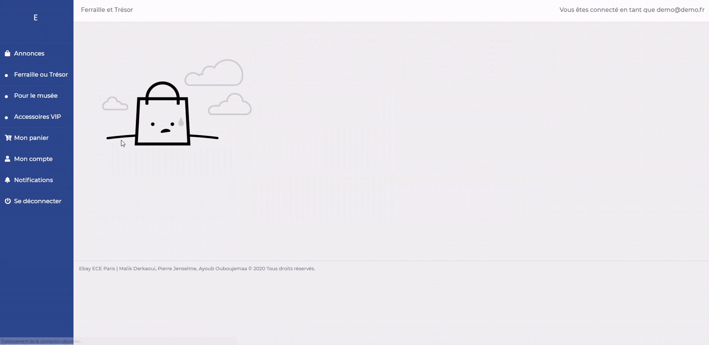

[![LinkedIn][linkedin-shield]][linkedin-url]

<!-- PROJECT LOGO -->
 

  <h3 align="center">Ebay ECE</h3>

  

    Site Web Ebay ECE
  

  
<b>Malik Derkaoui</b>

<!-- ABOUT THE PROJECT -->
## À propos du projet

Ce projet est un projet (HTML/CSS/PHP/SQL) réalisé en 1 semaine (piscine), c'est un site avec plusieurs fonctionnalités tel qu'un système d'achat direct acheteur/vendeur, un système d'enchère et un système de négociation.
Un pannel admin est disponible permettant de réguler toutes les transactions, les items présents sur le site etc.

[linkedin-shield]: https://img.shields.io/badge/-LinkedIn-black.svg?style=flat-square&logo=linkedin&colorB=555
[linkedin-url]: https://www.linkedin.com/in/malik-derkaoui-84a52a163/
[product-screenshot]: images/screenshot.png
